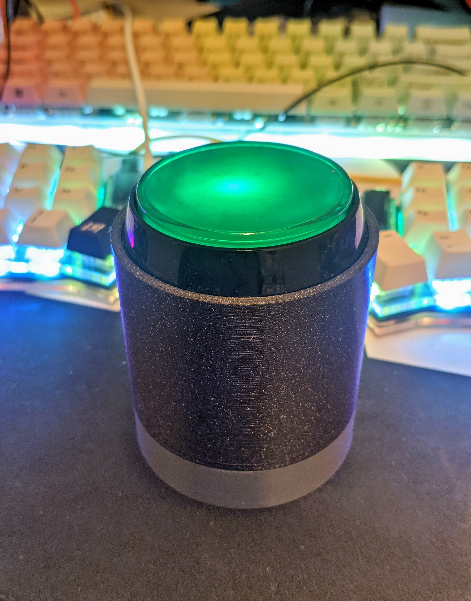

# Freelancer Buzzer

The Freelancer Buzzer is a very simple device, one button.  
When you push it, it makes a call to the url of your choice (ON_TRIGGER_URL in [include/configuration.h](include/configuration.h)), and when you push it again it calls another url of your choice (OFF_TRIGGER_URL in [include/configuration.h](include/configuration.h)).  
That means you can easily use it as a timer while you are working. I'm personally connecting it to https://github.com/pcboy/timetr4cker .

# BOM

ESP32 and an arcade button, that's it!

ESP32: https://www.aliexpress.com/item/4000340140634.html  
Button: https://www.aliexpress.com/item/32764952742.html

# Configuration

Check [include/configuration.h](include/configuration.h) 

# Compilation

You need platformIO, then simply do platformio run -t upload.  
Check the platformio.ini, you may need to change the serial port depending on your config.

